<!-- Animated banner (lives in this repo: assets/banner.svg) -->

  

<!-- Typing animation -->

  

<!-- Badges -->

  
  

 

## 🚀 About Me

- 🤖 **AI Full Stack Engineer** based in **India**
- 💻 I build the **frontend, backend and APIs** of a product
- 🧠 I add **AI features** using LLMs and model APIs
- 🚢 I **deploy what I build** with Docker, Kubernetes and CI/CD
- ☁️ **AWS** is my home cloud, with Azure and Google Cloud alongside
- 📊 I keep it healthy with **Prometheus and Grafana**

 

## 🔁 Development to Deployment

<table align="center">
  <tr>
    <td align="center" width="25%">🧠 <b>AI</b> LLM features and model APIs</td>
    <td align="center" width="25%">💻 <b>Develop</b> Frontend, backend, databases</td>
    <td align="center" width="25%">🚢 <b>Deploy</b> Containers, IaC, CI/CD on AWS</td>
    <td align="center" width="25%">📊 <b>Operate</b> Monitoring and alerting</td>
  </tr>
</table>

## 🛠️ Tech Stack

<table align="center">
  <tr>
    <td align="center" width="190"><b>🧠 AI and LLM</b></td>
    <td>
      
      
      
      
    </td>
  </tr>
  <tr>
    <td align="center"><b>🎨 Frontend</b></td>
    <td>
      
    </td>
  </tr>
  <tr>
    <td align="center"><b>⚙️ Backend</b></td>
    <td>
      
    </td>
  </tr>
  <tr>
    <td align="center"><b>🗄️ Databases</b></td>
    <td>
      
    </td>
  </tr>
  <tr>
    <td align="center"><b>☁️ Cloud</b></td>
    <td>
      
    </td>
  </tr>
  <tr>
    <td align="center"><b>📦 Containers and IaC</b></td>
    <td>
      
    </td>
  </tr>
  <tr>
    <td align="center"><b>🔁 CI/CD and GitOps</b></td>
    <td>
      
      
    </td>
  </tr>
  <tr>
    <td align="center"><b>📊 Monitoring</b></td>
    <td>
      
    </td>
  </tr>
  <tr>
    <td align="center"><b>🐧 OS and Scripting</b></td>
    <td>
      
    </td>
  </tr>
</table>

## 📈 GitHub Stats

  
  

  

## 🤝 Connect With Me

  
  
  

<!-- Animated footer (lives in this repo: assets/footer.svg) -->

  

